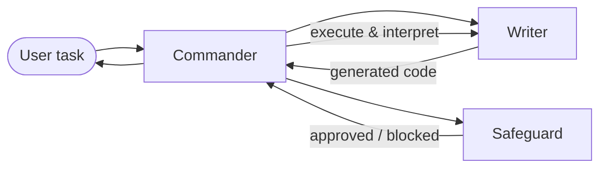

# Multi-Agent Evaluation

A reproducible benchmark suite for comparing **multi-agent coding systems** across orchestration frameworks — not just whether they pass tests, but how much time and tokens they spend, and where the overhead actually comes from.

The same **Commander → Writer → Safeguard** workflow is implemented on top of **LangGraph**, **AutoGen**, and **SPADE**, with a **single-agent baseline** for contrast. Every run produces structured conversation logs and a consistent metrics envelope, so comparisons stay apples-to-apples.

---

## Why this project exists

Multi-agent systems are easy to demo and hard to evaluate fairly. Different frameworks schedule agents differently, count tokens differently, and hide orchestration cost in different places. This repo treats that as a measurement problem:

- **Same agent roles and task loop** across frameworks
- **Same benchmarks and scoring** (HumanEval, AetherCode, and more)
- **Same observability layer** — JSONL conversation logs with per-step timing, token usage, and orchestration gaps

The goal is practical: help you choose (or build) a multi-agent stack based on evidence, not hype.

---

## Highlights

|                              |                                                                                                                                                    |
| ---------------------------- | -------------------------------------------------------------------------------------------------------------------------------------------------- |
| **4 orchestration backends** | LangGraph (LangChain), AutoGen, SPADE, plus a single-agent control                                                                                 |
| **Coding benchmarks**        | [HumanEval](https://github.com/openai/human-eval), [AetherCode](https://huggingface.co/datasets) (competitive programming), MultiAgentBench subset |
| **Deep metrics**             | Accuracy, latency, token breakdown, inter-agent messages, safeguard blocks, LLM wall time vs orchestration residual                                |
| **Fair comparison**          | Shared `CodingMASBase` interface, unified conversation log schema, framework-specific gap attribution (LangGraph node gaps vs AutoGen step gaps)   |
| **Production-minded runner** | `cross_framework_benchmark.py` supports repeated trials, resume from partial JSON, and auto-generated Markdown reports                             |

### Sample result (GPT-5.4, 5 HumanEval tasks × 3 repeats)

On straightforward HumanEval problems, all multi-agent frameworks reached **100% pass rate** — but **SPADE finished ~35% faster** than LangChain/AutoGen with fewer tokens. On harder AetherCode tasks, accuracy dropped across the board and framework differences became meaningful (see full tables in [`results.md`](results.md)).

---

## Agent architecture

Every coding MAS follows the same three-role pattern:



| Agent         | Responsibility                                                                  |
| ------------- | ------------------------------------------------------------------------------- |
| **Commander** | Orchestrates the loop, holds shared memory, runs code, returns the final answer |
| **Writer**    | Generates code and interprets execution output                                  |
| **Safeguard** | Reviews code for safety before execution                                        |

The workflow retries on safeguard blocks or execution failures until success or `max_iterations`. Details: [`coding_scenario/workflow.md`](coding_scenario/workflow.md).

---

## Quick start

### Prerequisites

- Python 3.10+
- An OpenAI API key
- `wget` (optional — used to fetch `testlib.h` for AetherCode checker compilation)

### Setup

```bash
git clone https://github.com/Krzach/multi-agent-evaluation.git
cd multi-agent-evaluation

python3 -m venv venv
source venv/bin/activate

pip install -r requirements.txt
cp .env.example .env   # add your OPENAI_API_KEY
```

### Run the cross-framework benchmark

This is the main entry point — it runs HumanEval (and AetherCode by default) across all frameworks with repeated trials and writes a report to `results.md`:

```bash
python cross_framework_benchmark.py --repeats 3
```

Useful flags:

```bash
# Smaller smoke test
python cross_framework_benchmark.py --tasks 3 --repeats 1 --aether-tasks 0

# Resume after interruption (merges into existing JSON)
python cross_framework_benchmark.py --resume --save-json results/cross_framework_results.json

# AetherCode only
python cross_framework_benchmark.py --aether-only --aether-tasks 10 --repeats 3
```

### Run a single benchmark / framework

```bash
# HumanEval on one framework
python run_human_eval.py --framework spade --limit 10 --model gpt-5.4

# AetherCode competitive programming tasks
python run_aether_eval.py --framework langchain --limit 5 --difficulty Easy

# MultiAgentBench subset
python run_mab_eval.py
```

---

## Metrics

Each task run produces a JSON result object with:

- **`correctness`** — did the solution pass the benchmark tests?
- **`cost_metrics`** — input / output / total tokens
- **`time_metrics`** — end-to-end task wall time
- **`collaboration_metrics`** — messages between agents, iteration count, safeguard blocks
- **`conversation_log_metrics`** — LLM API time vs non-LLM time per agent, orchestration gaps, wall-time decomposition

The metrics package parses JSONL conversation logs to attribute overhead precisely — for example, separating LangGraph between-node idle time from actual LLM calls.

Full reference: [`metrics/METRICS.md`](metrics/METRICS.md) · How `results.md` tables are built: [`results_metrics_explained.md`](results_metrics_explained.md)

---

## Project structure

```
multi-agent-evaluation/
├── cross_framework_benchmark.py   # Main benchmark runner + report generator
├── run_human_eval.py              # HumanEval for a single framework
├── run_aether_eval.py             # AetherCode for a single framework
├── run_mab_eval.py                # MultiAgentBench subset
│
├── coding_scenario/               # MAS implementations
│   ├── base.py                    # Shared interface + conversation logging
│   ├── langchain/                 # LangGraph-based MAS + callbacks
│   ├── autogen/                   # AutoGen agent-chat MAS
│   ├── spade_mas.py               # SPADE orchestration
│   └── single_agent_mas.py        # Baseline (no multi-agent loop)
│
├── benchmarks/                    # Dataset loaders + eval runners
│   ├── human_eval/
│   ├── aether_code/
│   ├── multiagentbench/
│   └── gaia/
│
├── metrics/                       # Conversation log → metrics pipeline
└── results.md                     # Example benchmark output
```

---

## Frameworks compared

| Framework                 | Implementation       | Notes                                                                    |
| ------------------------- | -------------------- | ------------------------------------------------------------------------ |
| **LangChain / LangGraph** | `LangchainCodingMAS` | Graph-based orchestration; `TimeBetweenNodesCallback` measures node gaps |
| **AutoGen**               | `AutoGenCodingMAS`   | Agent-chat with manual step-boundary gap tracking                        |
| **SPADE**                 | `SpadeCodingMAS`     | Alternative multi-agent orchestration layer                              |
| **Single agent**          | `SingleAgentMAS`     | One LLM call path — isolates the cost of multi-agent coordination        |

All implementations extend `CodingMASBase` and emit logs conforming to `coding_scenario/conversation_log.schema.json`.

---

## What we learned (and measured)

Running these benchmarks surfaced a few patterns worth sharing:

1. **Multi-agent overhead is real but framework-dependent.** On HumanEval, LangChain showed significant between-node time; AutoGen and SPADE kept orchestration gaps near zero.
2. **More agents ≠ better on hard tasks.** AetherCode accuracy varied widely (16–43% in our runs) while single-agent used far fewer tokens — collaboration has a cost.
3. **Token usage tracks architecture.** Multi-agent runs used ~10–15× more tokens than the single-agent baseline on the same model, even when accuracy matched.
4. **Good observability changes the conversation.** Per-step residual overhead and wall-time decomposition make it possible to optimize the right layer (scheduling vs prompting vs safety checks).

---
